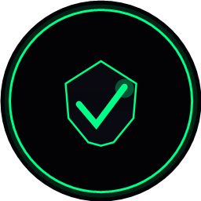

<div align="center">

# 🔒 VPNProbe

**Проверка VPN подписок и протоколов**

[](https://dotnet.microsoft.com/)
[](https://learn.microsoft.com/dotnet/desktop/wpf/)
[](LICENSE)
[](https://github.com/R3G1ST/VPNProbe/releases)



</div>

---

## ✨ Возможности

- 🔍 **Проверка серверов** — Ping, Port, TLS, Proxy (sing-box), DPI
- 📋 **Управление подписками** — сохранение, выбор, авто-имя
- 🎯 **Реал-тайм модалка** — живой прогресс с таблицей результатов
- 📊 **Аудит провайдера** — IP, DPI детекция, скорость, bufferbloat, DNS, гео-блокировка
- 🎨 **Тёмная тема** — cyber-стиль, антиалиасинг, закруглённые углы
- 📦 **Установщик** — NSIS, ярлыки, деинсталлятор

## 📸 Скриншоты

<div align="center">

</div>

## 🚀 Скачать

| | |
|---|---|
| **Инсталлер** | [VPNProbe-Setup-1.0.1.exe](https://github.com/R3G1ST/VPNProbe/releases/download/v1.0.1/VPNProbe-Setup-1.0.1.exe) (75 MB) |
| **Требования** | Windows 10/11 x64 |

## 🛠️ Сборка из исходников

```bash
# Клонировать
git clone https://github.com/R3G1ST/VPNProbe.git
cd VPNProbe

# Собрать
dotnet publish -c Release -r win-x64 --self-contained true /p:PublishSingleFile=true

# Или запустить в dev-режиме
dotnet run
```

## 📋 Проверки

| Проверка | Описание |
|----------|----------|
| **Ping** | ICMP ping до сервера |
| **Port/TLS** | TCP порт + TLS/Reality handshake |
| **Proxy** | Подключение через sing-box |
| **DPI** | Детекция блокировки DPI |

## 🏗️ Структура проекта

```
VPNProbe/
├── App.xaml              # Тёмная тема, стили
├── MainWindow.xaml       # Главное окно
├── Models/
│   ├── ServerInfo.cs     # Модели серверов
│   └── AuditModels.cs    # Модели аудита
├── Services/
│   ├── SubscriptionParser.cs   # Парсинг подписок
│   ├── PingChecker.cs          # ICMP ping
│   ├── PortTlsChecker.cs       # Port + TLS/Reality
│   ├── ProxyChecker.cs         # sing-box проверка
│   ├── DpiChecker.cs           # DPI детекция
│   ├── AuditServices.cs        # Аудит провайдера
│   └── SubscriptionManager.cs  # Сохранение ссылок
└── Views/
    ├── CheckProgressWindow.xaml    # Модалка проверки
    └── SavedLinksWindow.xaml       # Сохранённые ссылки
```

## ⚙️ Используемые технологии

- **C# / .NET 8** — WPF приложение
- **sing-box** — проверка прокси
- **Open-Meteo** — API погоды (для аудита)
- **NSIS** — установщик

## 📄 Лицензия

MIT License — используй свободно.

---

<div align="center">

**R3G1ST** • [GitHub](https://github.com/R3G1ST)

</div>
